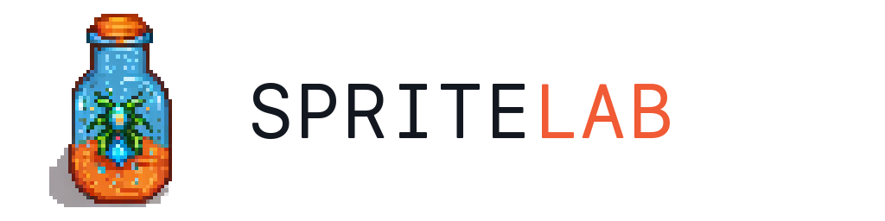
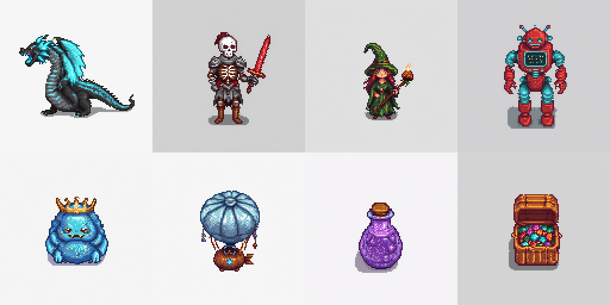

# Spritelab

<p align="center">
  
</p>

Spritelab generates isolated pixel art game sprites with Stable Diffusion XL and the Pixel Art XL adapter. The primary path is local GPU generation with transparent PNG export. Kaggle is available for batch runs on a Tesla T4.

## Model path

- Stable Diffusion XL Base 1.0
- Pixel Art XL
- Optional LCM adapter for 8 step generation
- 1024 generation, then transparent crop and nearest neighbor export at 64, 96, or 128

## Showcase

<p align="center">
  
</p>

Logo and showcase images were generated with this workflow.

## Local web app

CUDA GPU with about 8 GB VRAM recommended. On lower VRAM machines:

```bash
export SPRITELAB_CPU_OFFLOAD=1
```

Install and run:

```bash
python3 -m pip install -r requirements.txt
python3 -m uvicorn app:app --host 127.0.0.1 --port 8000
```

Open `http://127.0.0.1:8000`.

CLI:

```bash
python3 -m scripts.generate_sprite "blue slime with a gold crown" --mode quality --size 128
```

## Kaggle batch jobs

Edit `JOBS`, `MODE`, `SEEDS`, and `EXPORT_SIZE` in `kaggle_sdxl/generate.py`, then:

```bash
python3 -m kaggle kernels push -p kaggle_sdxl
```

Kernel: https://www.kaggle.com/code/gabrielep09/spritelab-sdxl-benchmark

Pinned Kaggle packages: `requirements-kaggle.txt`

Other scripts in `kaggle_sdxl/`:

- `benchmark.py` full evaluation grid
- `showcase.py` logo and marketing assets
- `sprite_export.py` transparent crop helper

## Layout

```text
app.py                      FastAPI service
web/                        Browser UI
scripts/generate_sprite.py  SDXL pipeline
scripts/sprite_export.py    Transparent crop and export
scripts/prompt_templates.py Shared prompts and presets
kaggle_sdxl/                Batch and benchmark scripts
assets/                     Logo and showcase images
tests/                      Unit tests
```

## Notes

- Quality mode peaks around 5.5 GB VRAM on a Kaggle T4
- Complex action placement such as fire breath can still be inconsistent
- Generated weights, scraped assets, and Kaggle outputs are gitignored
- Scraped GBA assets are copyrighted and are not part of this repository

External models:

- https://huggingface.co/stabilityai/stable-diffusion-xl-base-1.0
- https://huggingface.co/nerijs/pixel-art-xl
- https://huggingface.co/latent-consistency/lcm-lora-sdxl
